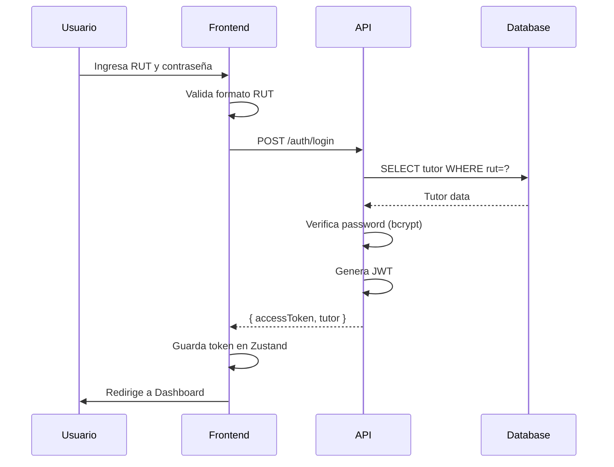
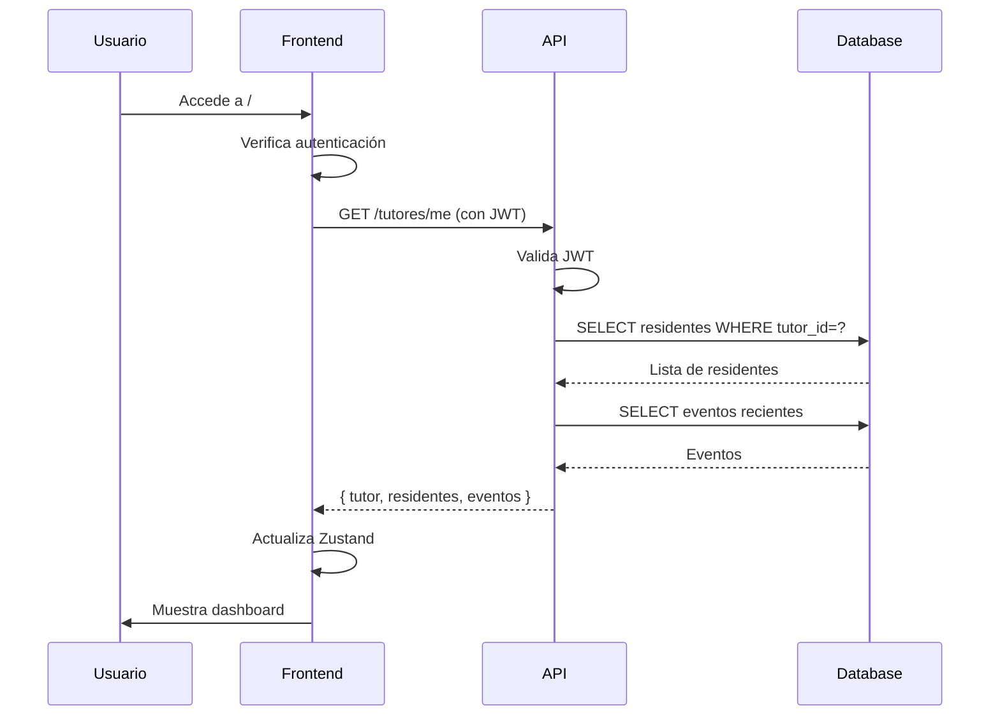
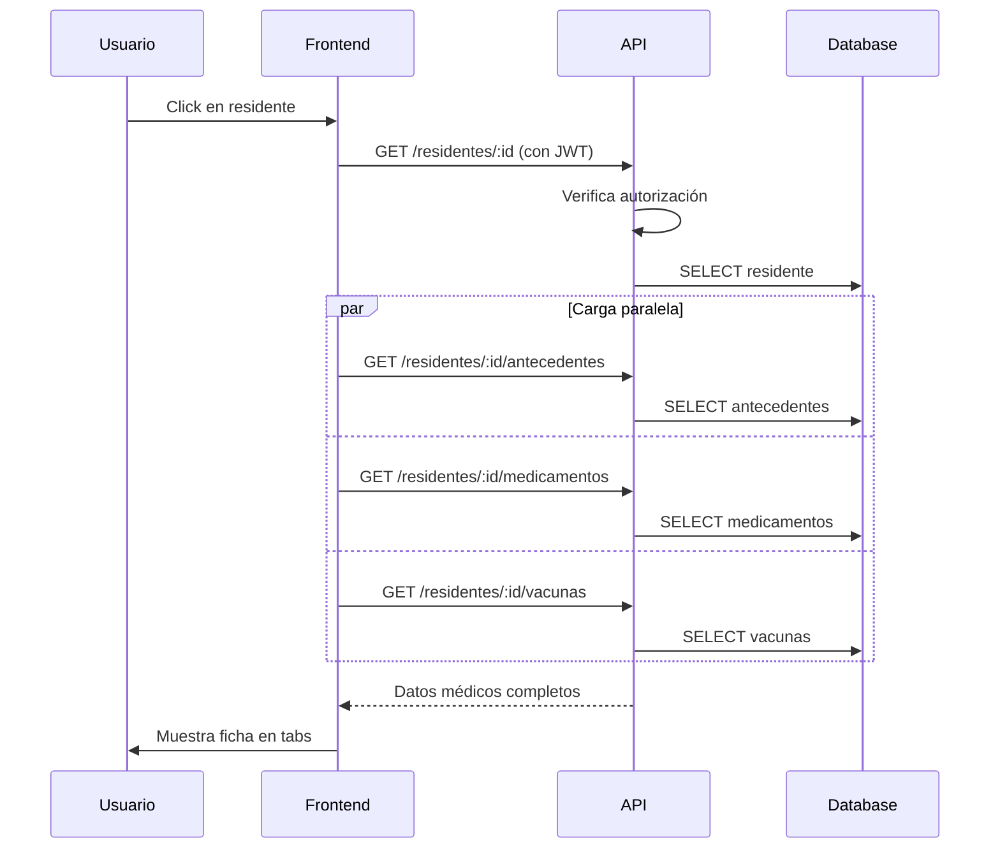
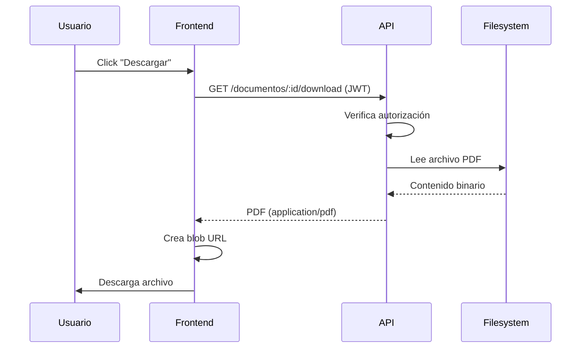

# Arquitectura de SOMA Tutor

## 📐 Visión General

SOMA Tutor es una aplicación web de arquitectura cliente-servidor que sigue el patrón **SPA (Single Page Application)** en el frontend y **API REST** en el backend.

```
┌─────────────────────────────────────────────────────────────┐
│                         NAVEGADOR                            │
│  ┌────────────────────────────────────────────────────────┐ │
│  │         React SPA (Frontend)                           │ │
│  │  ┌──────────┐  ┌──────────┐  ┌──────────────────────┐ │ │
│  │  │  Pages   │  │  Store   │  │  Components          │ │ │
│  │  │          │  │ (Zustand)│  │                      │ │ │
│  │  └────┬─────┘  └────┬─────┘  └──────────────────────┘ │ │
│  │       │             │                                  │ │
│  │       └─────────────┴──────────┐                       │ │
│  │                                 ▼                       │ │
│  │                        ┌─────────────────┐              │ │
│  │                        │  API Services   │              │ │
│  │                        │  (Axios)        │              │ │
│  │                        └────────┬────────┘              │ │
│  └─────────────────────────────────┼─────────────────────┘ │
└────────────────────────────────────┼───────────────────────┘
                                     │ HTTP/HTTPS
                                     │ JSON + JWT
┌────────────────────────────────────┼───────────────────────┐
│                    SERVIDOR        ▼                        │
│  ┌─────────────────────────────────────────────────────┐   │
│  │              Nginx (Reverse Proxy)                  │   │
│  │  ┌──────────────────┐    ┌──────────────────────┐  │   │
│  │  │  /  → Frontend   │    │  /api → Backend      │  │   │
│  │  │  (Static Files)  │    │  (PHP-FPM)           │  │   │
│  │  └──────────────────┘    └──────────┬───────────┘  │   │
│  └───────────────────────────────────────┼────────────┘   │
│                                          ▼                 │
│  ┌──────────────────────────────────────────────────────┐ │
│  │         CodeIgniter 4 (Backend API)                  │ │
│  │  ┌─────────┐  ┌──────────┐  ┌───────────────────┐  │ │
│  │  │ Routes  │→ │ Filters  │→ │  Controllers      │  │ │
│  │  │         │  │ (JWT)    │  │                   │  │ │
│  │  └─────────┘  └──────────┘  └──────┬────────────┘  │ │
│  │                                     ▼               │ │
│  │                              ┌──────────────┐       │ │
│  │                              │   Models     │       │ │
│  │                              └──────┬───────┘       │ │
│  └─────────────────────────────────────┼──────────────┘ │
│                                        ▼                  │
│  ┌──────────────────────────────────────────────────────┐ │
│  │            SQLite Database                           │ │
│  │  (tutores, residentes, medicamentos, eventos, etc.)  │ │
│  └──────────────────────────────────────────────────────┘ │
└───────────────────────────────────────────────────────────┘
```

---

## 🏗 Capas de la Aplicación

### 1. Capa de Presentación (Frontend)

#### Tecnologías
- **React 18.2**: Biblioteca UI
- **TypeScript**: Tipado estático
- **Material UI**: Componentes y tema
- **React Router**: Enrutamiento SPA
- **Zustand**: Estado global
- **Axios**: Cliente HTTP

#### Estructura de Directorios

```
frontend/src/
├── app/                    # Configuración de la aplicación
│   ├── layout/            # Layouts (MainLayout, AuthLayout)
│   └── theme.ts           # Tema MUI personalizado
│
├── features/              # Módulos por funcionalidad
│   ├── auth/             # Login, autenticación
│   ├── dashboard/        # Dashboard principal
│   ├── ficha/            # Ficha clínica
│   ├── actividades/      # Actividades del residente
│   ├── documentos/       # Gestión de documentos
│   ├── test/             # Tests clínicos
│   └── eventos/          # Eventos clínicos
│
├── components/            # Componentes reutilizables
│   ├── LoadingSpinner.tsx
│   ├── ErrorAlert.tsx
│   └── ResidenteCard.tsx
│
├── services/              # Servicios API
│   ├── api.ts            # Instancia Axios configurada
│   ├── authService.ts    # Autenticación
│   ├── tutorService.ts   # Operaciones de tutor
│   └── residenteService.ts # Operaciones de residente
│
├── store/                 # Estado global (Zustand)
│   ├── authStore.ts      # Estado de autenticación
│   ├── themeStore.ts     # Tema (claro/oscuro)
│   └── residenteStore.ts # Residentes actuales
│
└── utils/                 # Utilidades
    ├── rutUtils.ts       # Validación y formato de RUT
    └── dateUtils.ts      # Formato de fechas
```

#### Flujo de Datos

```
Usuario Interactúa → Componente React
                          ↓
                    Hook useState/Zustand
                          ↓
                    Service (Axios)
                          ↓
                    API Backend
                          ↓
                    Respuesta JSON
                          ↓
                    Actualiza Estado
                          ↓
                    Re-renderiza UI
```

---

### 2. Capa de Lógica de Negocio (Backend)

#### Tecnologías
- **CodeIgniter 4**: Framework MVC
- **PHP 8.2**: Lenguaje
- **lcobucci/jwt**: Autenticación JWT
- **SQLite**: Base de datos (demo)

#### Estructura de Directorios

```
backend/app/
├── Config/                # Configuración
│   ├── Routes.php        # Definición de rutas API
│   ├── Database.php      # Conexión a BD
│   ├── Filters.php       # Registro de filtros
│   └── App.php           # Configuración general
│
├── Controllers/Api/V1/    # Controladores REST
│   ├── AuthController.php      # Login, JWT
│   ├── TutorController.php     # Info del tutor
│   ├── ResidenteController.php # Residentes
│   ├── FichaController.php     # Ficha médica
│   ├── SeguimientoController.php # Actividades/Eventos
│   └── DocumentoController.php  # Documentos
│
├── Models/                # Modelos de datos
│   ├── TutorModel.php
│   ├── ResidenteModel.php
│   ├── MedicamentoModel.php
│   ├── VacunaModel.php
│   ├── TestClinicoModel.php
│   ├── ActividadModel.php
│   ├── EventoClinicoModel.php
│   └── DocumentoModel.php
│
├── Filters/               # Middleware
│   ├── JWTAuthFilter.php # Validación de JWT
│   └── CorsFilter.php    # CORS
│
└── Database/
    ├── Migrations/        # Esquema de BD
    └── Seeds/             # Datos iniciales
```

#### Flujo de Request

```
HTTP Request → Nginx → PHP-FPM → CodeIgniter
                                      ↓
                                  Routing
                                      ↓
                                  Filters (JWT, CORS)
                                      ↓
                                  Controller
                                      ↓
                                  Model → Database
                                      ↓
                                  JSON Response
```

---

### 3. Capa de Datos

#### Modelo Entidad-Relación

```
┌─────────────┐         ┌──────────────────┐         ┌─────────────┐
│   Tutor     │────────│ TutorResidente   │────────│  Residente  │
│             │ 1    N │                  │ N    1 │             │
│ - id        │        │ - tutor_id       │        │ - id        │
│ - rut       │        │ - residente_id   │        │ - rut       │
│ - nombre    │        └──────────────────┘        │ - nombre    │
│ - email     │                                     │ - foto_url  │
│ - password  │                                     └──────┬──────┘
└─────────────┘                                            │
                                                           │ 1
                                        ┌──────────────────┼──────────────────┐
                                        │                  │                  │
                                        │                  │                  │
                                   ┌────▼─────┐      ┌────▼────┐      ┌─────▼────┐
                                   │Anteceden-│      │Medicamen│      │ Vacunas  │
                                   │    te    │      │   to    │      │          │
                                   └──────────┘      └─────────┘      └──────────┘
                                        │                  │                  │
                         ┌──────────────┼──────────────────┼──────────────────┘
                         │              │                  │
                    ┌────▼────┐    ┌───▼──────┐      ┌───▼──────┐
                    │  Test   │    │Actividad │      │  Evento  │
                    │ Clínico │    │          │      │ Clínico  │
                    └─────────┘    └──────────┘      └──────────┘
                         │
                    ┌────▼────┐
                    │Documento│
                    └─────────┘
```

#### Tablas Principales

1. **tutores**: Información de tutores/apoderados
2. **residentes**: Información de residentes
3. **tutor_residente**: Relación N:N entre tutores y residentes
4. **antecedentes**: Antecedentes médicos
5. **medicamentos**: Medicamentos activos
6. **vacunas**: Registro de vacunación
7. **test_clinicos**: Tests (Katz, Barthel, Pfeiffer, etc.)
8. **actividades**: Actividades diarias y cuidados
9. **eventos_clinicos**: Eventos importantes
10. **documentos**: Contratos, liquidaciones, etc.

---

## 🔐 Seguridad

### Autenticación JWT

```
1. Login (POST /api/v1/auth/login)
   Usuario envía: { rut, password }
   
2. Validación
   - Buscar tutor por RUT
   - Verificar password con bcrypt
   
3. Generar JWT
   - Payload: { tutor_id, rut, nombre }
   - Firma: HMAC-SHA256 con secret
   - Expiración: 30 minutos
   
4. Respuesta
   { accessToken: "eyJ0eXAi...", tutor: {...} }
```

### Autorización

```
1. Request con JWT (Header: Authorization: Bearer {token})

2. JWTAuthFilter
   - Extraer token del header
   - Validar firma
   - Verificar expiración
   - Extraer tutor_id
   
3. Controller
   - Verificar que tutor tiene acceso al recurso
   - Ej: TutorModel->tieneAccesoResidente(tutor_id, residente_id)
   
4. Respuesta o Error 403 Forbidden
```

---

## 🔄 Flujos de Trabajo Principales

### 1. Inicio de Sesión



### 2. Visualizar Dashboard



### 3. Ver Ficha Clínica



### 4. Descargar Documento



---

## ⚡ Optimizaciones de Rendimiento

### Frontend

1. **Code Splitting**
   ```typescript
   // Lazy loading de rutas
   const DashboardPage = lazy(() => import('./features/dashboard/DashboardPage'))
   ```

2. **Memoización**
   ```typescript
   const MemoizedCard = React.memo(ResidenteCard)
   ```

3. **Zustand (Estado ligero)**
   - Más rápido que Redux
   - Sin boilerplate
   - Re-renderizaciones mínimas

### Backend

1. **Índices en BD**
   ```sql
   CREATE INDEX idx_residente_medicamentos ON medicamentos(residente_id)
   CREATE INDEX idx_residente_eventos ON eventos_clinicos(residente_id, fecha_hora)
   ```

2. **Paginación**
   ```php
   public function getActividades(int $residenteId, int $page = 1, int $perPage = 20)
   ```

3. **Cache de respuestas** (futuro)
   - Redis para datos frecuentes
   - Cache-Control headers

---

## 🧪 Testing

### Frontend (Vitest)

```typescript
// Ejemplo: Test de validación RUT
describe('validateRut', () => {
  it('valida RUT correcto', () => {
    expect(validateRut('11.111.111-1')).toBe(true)
  })
})
```

### Backend (PHPUnit)

```php
// Ejemplo: Test de autenticación
public function testLoginConCredencialesValidas()
{
    $result = $this->post('/api/v1/auth/login', [
        'rut' => '11.111.111-1',
        'password' => 'Demo123*'
    ]);
    $result->assertStatus(200);
}
```

---

## 🚀 Despliegue

### Contenedores Docker

```
┌─────────────────────────────────────────┐
│  nginx (puerto 80/443)                  │
│  ├─ Sirve frontend estático (/)         │
│  └─ Proxy a backend (/api)              │
└──────────────┬──────────────────────────┘
               │
┌──────────────▼──────────────────────────┐
│  backend (PHP-FPM)                      │
│  ├─ CodeIgniter 4                       │
│  ├─ SQLite DB en /writable              │
│  └─ Procesa requests API                │
└─────────────────────────────────────────┘
```

### Variables de Entorno

```bash
JWT_SECRET=...           # Secret para firmar JWT
CORS_ALLOWED_ORIGINS=... # Orígenes permitidos
VITE_API_URL=...        # URL de la API para frontend
```

---

## 📊 Monitoreo y Logs

### Logs del Backend

```
writable/logs/log-YYYY-MM-DD.log
```

Eventos registrados:
- Intentos fallidos de login
- Rate limit excedido
- Errores de validación JWT
- Accesos no autorizados

### Logs de Nginx

```
/var/log/nginx/access.log
/var/log/nginx/error.log
```

---

## 🔮 Extensiones Futuras

### PWA (Progressive Web App)
- Service workers para cache offline
- Manifest.json
- Push notifications

### WebSockets
- Notificaciones en tiempo real
- Chat con el ELEAM
- Actualizaciones automáticas

### Microservicios
- Separar autenticación
- Servicio de notificaciones
- Servicio de reportes

---

Esta arquitectura proporciona una base sólida, escalable y mantenible para SOMA Tutor.


